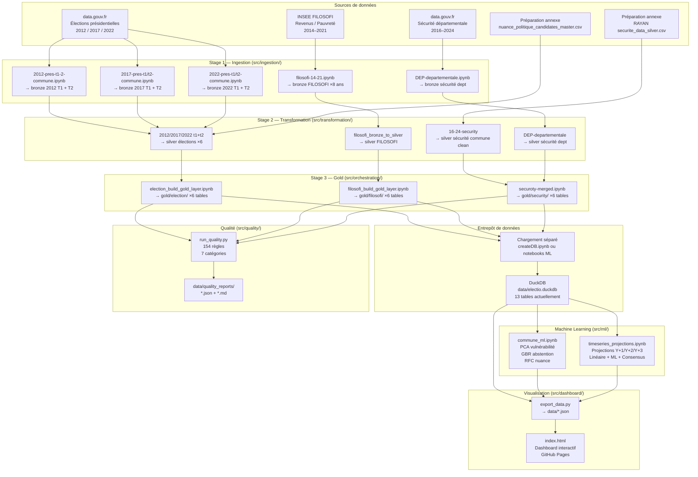
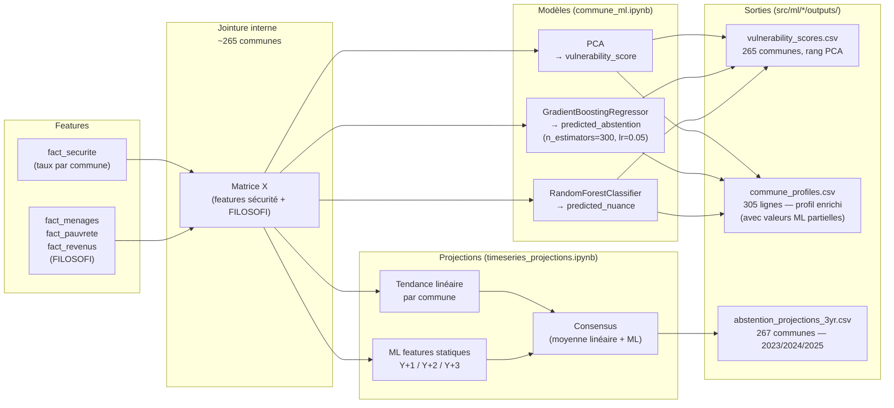

# Architecture — Electio Analytics POC

**Périmètre :** Élections présidentielles 2012 · 2017 · 2022, Département du Rhône (69)
**Couverture actuelle :** 305 lignes dans `dim_commune` élections (293 `id_commune` uniques), 267 communes comparables sur les 6 scrutins, 265 communes croisées pour les analyses multi-domaines
**Certification :** MSPR — Bloc 3 Big Data & BI — RNCP 35584

---

## 1. Vue d'ensemble

Le projet implémente une **architecture Médaillon** (Medallion Architecture) en quatre zones de données successives, chacune augmentant la qualité et la modélisation de la donnée brute jusqu'à la consommation analytique.

```
Sources externes
      │
      ▼
┌─────────────────────────────────────────────────────────────────────┐
│  RAW   Données sources originales, immuables                        │
│  data/raw/  ·  XLS élections  ·  TXT BV  ·  ZIP FILOSOFI  ·  CSV  │
└──────────────────────────┬──────────────────────────────────────────┘
                           │  Stage 1 – Ingestion (8 notebooks)
                           ▼
┌─────────────────────────────────────────────────────────────────────┐
│  BRONZE  Extraction filtrée Rhône-69, format CSV normalisé          │
│  data/bronze/  ·  CSV d'ingestion par source / millésime            │
└──────────────────────────┬──────────────────────────────────────────┘
                           │  Stage 2 – Transformation (10 notebooks)
                           ▼
┌─────────────────────────────────────────────────────────────────────┐
│  SILVER  Nettoyage, typage, dénormalisé candidat-par-ligne          │
│  data/silver/  ·  CSV normalisés + 1 entrée manuelle sécurité       │
└──────────────────────────┬──────────────────────────────────────────┘
                           │  Stage 3 – Gold (3 notebooks)
                           ▼
┌─────────────────────────────────────────────────────────────────────┐
│  GOLD  Schéma en étoile, 3 domaines, 18 tables CSV                  │
│  data/gold/  ·  DuckDB chargé séparément (createDB.ipynb / ML)     │
└──────────────┬───────────────────────┬──────────────────────────────┘
               │                       │
               ▼                       ▼
     ┌──────────────────┐    ┌──────────────────────────────┐
     │   ML / Analytics │    │  Dashboard (GitHub Pages)    │
     │  src/ml/         │    │  src/dashboard/index.html    │
     │  · PCA vulnérab. │    │  · 7 onglets interactifs     │
     │  · GBR abstention│    │  · Plotly.js + Bootstrap     │
     │  · RFC nuances   │    │  · données JSON pré-calculées│
     │  · Projections   │    └──────────────────────────────┘
     └──────────────────┘
               │
               ▼
     ┌──────────────────┐
     │  Qualité données │
     │  src/quality/    │
     │  154 règles      │
     │  JSON + MD report│
     └──────────────────┘
```

---

## 2. Diagramme de flux détaillé



---

## 3. Architecture Médaillon — détail par zone

### Zone RAW (`data/raw/`)

Données sources originales, **jamais modifiées**. Servent de point de re-ingestion si les notebooks Bronze sont réexécutés.

| Fichier | Source | Description |
|---------|--------|-------------|
| `2012_pres_t1_t2_communes_france.xls` | data.gouv.fr | Résultats 2012 T1 et T2, France entière |
| `PR17_BVot_T1_FE.txt` | data.gouv.fr | Résultats 2017 T1, niveau bureau de vote |
| `PR17_BVot_T2_FE.txt` | data.gouv.fr | Résultats 2017 T2, niveau bureau de vote |
| `2022_burvot_t1_france_entiere.xlsx` | data.gouv.fr | Résultats 2022 T1, niveau bureau de vote |
| `resultats-par-niveau-subcom-t2-france-entiere.xlsx` | data.gouv.fr | Résultats 2022 T2 |
| `DEP-departementale.csv` | data.gouv.fr | Sécurité niveau départemental |
| `filosofi/filosofi_20XX_insee.zip` | INSEE (×8) | FILOSOFI 2014–2021, ZIP par année |

### Entrées annexes hors zone RAW

Ces deux fichiers sont consommés par le pipeline actuel mais ne sont pas produits par `run_pipeline.py` :

| Fichier | Origine | Usage |
|---------|---------|-------|
| `data/reference/nuance_politique_candidates_master.csv` | `src/ingestion/nuance politique/nuance politique.ipynb` | Mapping candidat → nuance utilisé par les transforms élections |
| `data/silver/RAYAN securite_data_silver.csv` | Préparation manuelle hors orchestrateur | Entrée sécurité communale requise par `transform_securite` |

### Zone BRONZE (`data/bronze/`)

Extraction filtrée sur le **Rhône (code 69)**, format CSV standardisé, métadonnées d'ingestion ajoutées (`ingestion_timestamp`, `source_file_name`, `extraction_source_url`).

Format large (wide) pour les élections : une ligne par commune, colonnes candidate dupliquées (`Sexe_1`, `Nom_1`, `Voix_1` … `Voix_N`).

### Zone SILVER (`data/silver/`)

Nettoyage et normalisation :
- **Élections** : passage du format large au format long (une ligne par **commune × candidat**), recalcul des pourcentages au niveau commune, jointure avec le dictionnaire de nuances politiques (`data/reference/nuance_politique_candidates_master.csv`)
- **Sécurité** : typage strict (`Int64`, `Float64`), gestion du secret statistique INSEE (`est_diffuse = ndiff`)
- **FILOSOFI** : fusion des 8 années, gestion des trois modes de parsing INSEE (`xls_simple` 2014–2016, `csv_simple` 2017–2018, `csv_reconstructed` 2019–2021)

Schéma unifié 33 colonnes pour les élections.

### Zone GOLD (`data/gold/`)

Schéma en étoile (**Star Schema**) réparti en **3 domaines** et **18 tables** (6 par domaine).
Les notebooks gold écrivent uniquement les CSV dans `data/gold/`. Le chargement dans **DuckDB** (`data/electio.duckdb`) est une étape séparée, aujourd'hui réalisée via `createDB.ipynb` et/ou les notebooks ML qui relisent les CSV gold.

Voir [data_model.md](data_model.md) pour le schéma détaillé.

---

## 4. Couche Machine Learning



**Limite connue (POC) :** les features ML utilisent les données les plus récentes disponibles (sécurité 2024, FILOSOFI 2021) appliquées rétrospectivement aux élections 2012/2017/2022. Cette fuite temporelle est documentée dans la section 6.7 du dossier de synthèse.

---

## 5. Stack technique

| Composant | Technologie | Version |
|-----------|-------------|---------|
| Langage   | Python      | 3.12 (venv) |
| Notebooks | JupyterLab  | 4.4.0 |
| Données   | pandas      | 2.2.3 |
| Calcul    | numpy / scipy | 1.26.4 / 1.17.1 |
| ML        | scikit-learn | 1.8.0 |
| Entrepôt  | DuckDB      | 1.5.1 |
| Dashboard | Plotly.js + Bootstrap 5 | CDN |
| CI/CD     | GitHub Actions | — |
| Hébergement | GitHub Pages | — |

---

## 6. Structure des dossiers

```
electio-analytics-poc/
│
├── data/
│   ├── raw/                    Zone RAW  (sources immuables)
│   ├── bronze/                 Zone Bronze (extraction filtrée)
│   ├── silver/                 Zone Silver (nettoyage)
│   ├── gold/
│   │   ├── election/           Domaine élections (6 tables)
│   │   ├── security/           Domaine sécurité (6 tables)
│   │   └── filosofi/           Domaine FILOSOFI (6 tables)
│   ├── electio.duckdb          Entrepôt DuckDB (chargement séparé)
│   ├── quality_reports/        Rapports qualité horodatés (générés à la demande)
│   └── pipeline_logs/          Logs d'exécution pipeline (générés à la demande)
│
├── src/
│   ├── ingestion/              Stage 1 — 8 notebooks
│   ├── transformation/         Stage 2 — 10 notebooks
│   ├── orchestration/          Stage 3 — 3 notebooks + run_pipeline.py
│   ├── quality/                154 règles qualité + CLI
│   ├── ml/
│   │   ├── commune_model/      PCA + GBR + RFC
│   │   └── timeseries/         Projections Y+1/Y+2/Y+3
│   ├── dashboard/              Dashboard statique GitHub Pages
│   └── utils/                  Utilitaires partagés
│
├── docs/                       Documentation technique
├── createDB.ipynb              Chargement manuel des CSV gold vers DuckDB
├── requirements.txt            Dépendances Python
└── .github/workflows/          CI/CD GitHub Actions
```
