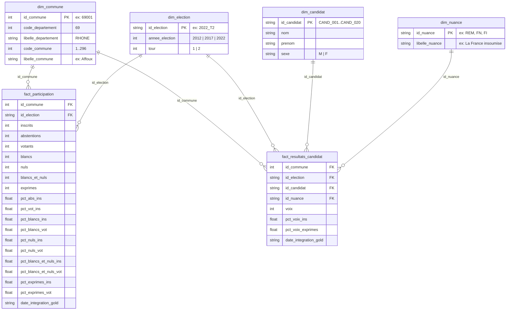
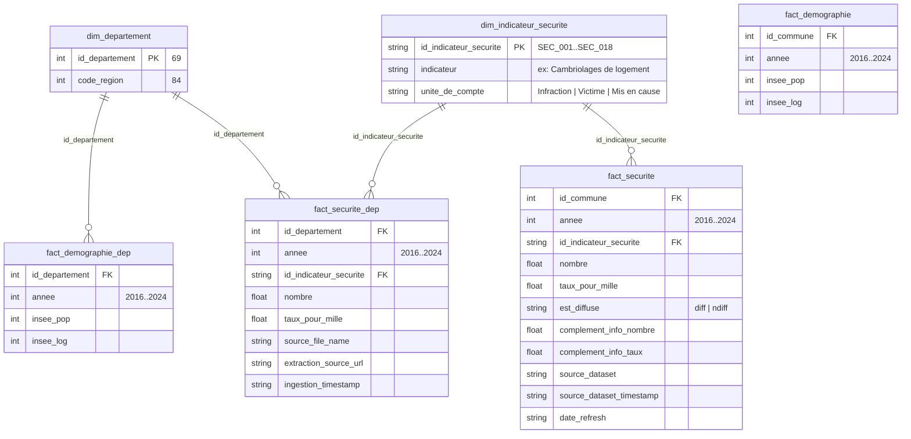
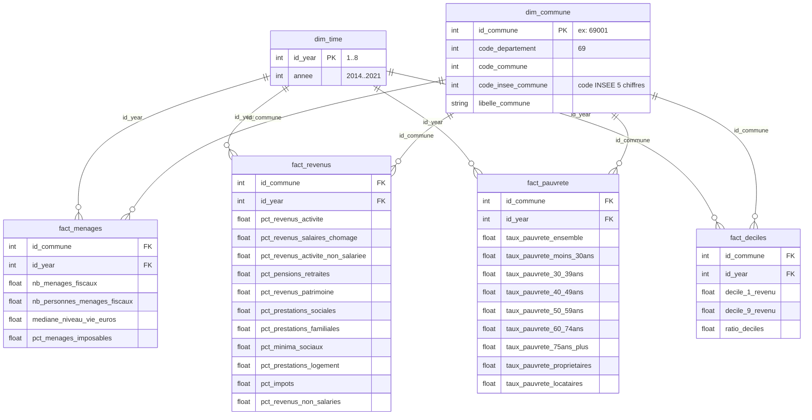

# Modèle de données — Electio Analytics POC

Toutes les tables gold sont stockées en CSV dans `data/gold/`. Le fichier DuckDB `data/electio.duckdb` est un chargement séparé de ces CSV, utilisé par les notebooks ML et les requêtes SQL.
Les cardinalités indiquées ci-dessous sont mesurées sur les fichiers actuels du Rhône (69).

---

## 1. Domaine Élections

**6 tables** · 6 scrutins · 305 lignes dans `dim_commune` (293 `id_commune` uniques) · 2012 T1, 2012 T2, 2017 T1, 2017 T2, 2022 T1, 2022 T2



### Cardinalités réelles

| Table | Lignes | Colonnes | Clé primaire |
|-------|--------|----------|--------------|
| `dim_election` | 6 | 3 | `id_election` |
| `dim_commune` | 305 | 5 | `id_commune` ¹ |
| `dim_candidat` | 20 | 4 | `id_candidat` |
| `dim_nuance` | 89 | 2 | `id_nuance` |
| `fact_participation` | 1 680 | 20 | `(id_commune, id_election)` |
| `fact_resultats_candidat` | 10 894 | 8 | `(id_commune, id_election, id_candidat)` |

> ¹ `dim_commune` contient 12 doublons d'`id_commune` correspondant aux fusions de communes 2017→2022 (les anciens et nouveaux noms sont conservés, ex : `69019` = "Belleville" ET "Belleville-en-Beaujolais"). Identifié par le module de qualité comme CRITICAL.
>
> Pour les usages analytiques, il faut distinguer trois périmètres :
> - `305` lignes brutes dans `dim_commune`
> - `293` `id_commune` uniques côté élections
> - `267` communes partagées par les 6 scrutins présidentiels

### Règles métier

| Règle | Formule |
|-------|---------|
| Conservation des voix | `inscrits = abstentions + votants` (tolérance ±1) |
| Conservation des bulletins | `votants = blancs_et_nuls + exprimes` (tolérance ±1) |
| Décomposition blancs/nuls | `blancs + nuls = blancs_et_nuls` (depuis la loi de 2014) |
| Percentages | Tous les champs `pct_*` ∈ [0, 100] |
| Somme des voix candidats | `Σ voix par (commune, election) ≈ exprimes` (tolérance 1%) |

---

## 2. Domaine Sécurité

**6 tables** · 18 indicateurs · 275 communes · 2016–2024



### Cardinalités réelles

| Table | Lignes | Colonnes | Clé primaire |
|-------|--------|----------|--------------|
| `dim_departement` | 1 | 2 | `id_departement` |
| `dim_indicateur_securite` | 18 | 3 | `id_indicateur_securite` |
| `fact_securite` | 37 125 | 11 | `(id_commune, annee, id_indicateur_securite)` |
| `fact_securite_dep` | 180 | 8 | `(id_departement, annee, id_indicateur_securite)` |
| `fact_demographie` | 2 475 | 4 | `(id_commune, annee)` |
| `fact_demographie_dep` | 10 | 4 | `(id_departement, annee)` |

### Les 18 indicateurs sécuritaires

| Code | Indicateur | Unité |
|------|-----------|-------|
| SEC_001 | Cambriolages de logement | Infraction |
| SEC_002 | Destructions et dégradations volontaires | Infraction |
| SEC_003 | Escroqueries et fraudes aux moyens de paiement | Victime |
| SEC_004 | Homicides | Victime |
| SEC_005 | Tentatives d'homicide | Victime |
| SEC_006 | Trafic de stupéfiants | Mis en cause |
| SEC_007 | Usage de stupéfiants | Mis en cause |
| SEC_008 | Usage de stupéfiants (AFD) | Mis en cause |
| SEC_009 | Usage de stupéfiants (hors AFD) | Mis en cause |
| SEC_010 | Violences physiques hors cadre familial | Victime |
| SEC_011 | Violences physiques intrafamiliales | Victime |
| SEC_012 | Violences sexuelles | Victime |
| SEC_013 | Vols avec armes | Infraction |
| SEC_014 | Vols d'accessoires sur véhicules | Véhicule |
| SEC_015 | Vols dans les véhicules | Véhicule |
| SEC_016 | Vols de véhicule | Véhicule |
| SEC_017 | Vols sans violence contre des personnes | Victime entendue |
| SEC_018 | Vols violents sans arme | Infraction |

### Secret statistique INSEE

`est_diffuse = 'ndiff'` indique qu'une valeur est supprimée par secret statistique. Sur les 37 125 lignes actuelles de `fact_securite` : `51.14%` diffusées (`diff`) et `48.86%` non-diffusées (`ndiff`).

---

## 3. Domaine FILOSOFI

**6 tables** · 273 communes · 2014–2021 (8 millésimes)

Source : INSEE Fichiers Localisés Inter et Inter-communaux (FILOSOFI) — revenus et niveaux de vie des ménages fiscaux.



### Cardinalités réelles

| Table | Lignes | Colonnes | Clé primaire |
|-------|--------|----------|--------------|
| `dim_time` | 8 | 2 | `id_year` |
| `dim_commune` | 273 | 5 | `id_commune` |
| `fact_menages` | 2 121 | 6 | `(id_commune, id_year)` |
| `fact_revenus` | 2 121 | 13 | `(id_commune, id_year)` |
| `fact_pauvrete` | 2 121 | 11 | `(id_commune, id_year)` |
| `fact_deciles` | 2 121 | 5 | `(id_commune, id_year)` |

> 273 communes FILOSOFI vs 293 `id_commune` uniques côté élections : l'écart de 20 communes correspond au périmètre FILOSOFI effectivement diffusé dans les fichiers gold actuels.

### Modes de parsing par millésime

| Années | Mode | Format source |
|--------|------|---------------|
| 2014–2016 | `xls_simple` | Classeur Excel, feuille "COM" |
| 2017–2018 | `csv_simple` | CSV unique `cc_filosofi_{annee}_com*.csv` |
| 2019–2021 | `csv_reconstructed` | Fusion de 3 CSV : DEC + DISP + DISP_Pauvres |

---

## 4. Entrepôt DuckDB — tables chargées

Le fichier `data/electio.duckdb` (DuckDB 1.5.1) contient actuellement **13 tables** chargées depuis les CSV gold via `createDB.ipynb` ou les notebooks ML. La jointure SQL entre domaines se fait via `id_commune` (entier, format `69XXX`).

```sql
-- Tables disponibles dans data/electio.duckdb
SHOW TABLES;
-- dim_candidat, dim_commune, dim_election, dim_indicateur_securite, dim_nuance
-- fact_deciles, fact_demographie, fact_menages, fact_participation
-- fact_pauvrete, fact_resultats_candidat, fact_revenus, fact_securite
```

### Jointure inter-domaines — exemple

```sql
-- Abstention 2022 T2 enrichie avec la médiane de niveau de vie
WITH commune_ref AS (
    SELECT
        id_commune,
        MIN(libelle_commune) AS libelle_commune
    FROM dim_commune
    GROUP BY id_commune
)
SELECT
    c.libelle_commune,
    p.pct_abs_ins                  AS abstention_pct,
    m.mediane_niveau_vie_euros     AS revenu_median,
    d.taux_pour_mille              AS taux_cambriolages
FROM fact_participation p
JOIN commune_ref      c  ON c.id_commune = p.id_commune
JOIN fact_menages     m  ON m.id_commune = p.id_commune AND m.id_year = 8  -- 2021
JOIN fact_securite    d  ON d.id_commune = p.id_commune
                        AND d.annee = 2024
                        AND d.id_indicateur_securite = 'SEC_001'
                        AND d.est_diffuse = 'diff'
WHERE p.id_election = '2022_T2'
ORDER BY abstention_pct DESC;
```

> Les jointures inter-domaines utilisant `dim_commune` côté élections doivent dédupliquer `id_commune` au préalable tant que les 12 doublons hérités des fusions communales ne sont pas corrigés en amont.

---

## 5. Sorties Machine Learning

Les modèles ML lisent depuis DuckDB et écrivent dans `src/ml/*/outputs/`.

| Fichier | Colonnes | Lignes | Modèle |
|---------|----------|--------|--------|
| `commune_model/outputs/vulnerability_scores.csv` | `id_commune, vulnerability_score, libelle_commune, rank` | 265 | PCA (non-supervisé) |
| `commune_model/outputs/commune_profiles.csv` | `id_commune, libelle_commune, vulnerability_score, rank, pct_abs_ins, predicted_abstention, libelle_nuance, predicted_nuance` | 305 | Profil composite (jointure gauche sur le périmètre élections) |
| `commune_model/outputs/abstention_predictions.csv` | `id_commune, pct_abs_ins, predicted_abstention` | 265 | GradientBoostingRegressor |
| `commune_model/outputs/nuance_predictions.csv` | `id_commune, libelle_nuance, predicted_nuance` | 265 | RandomForestClassifier |
| `timeseries/outputs/abstention_projections_3yr.csv` | `id_commune, libelle_commune, slope_per_year, abstention_last_year, linear_proj_2023..2025, ml_proj_2023..2025, consensus_proj_2023..2025, abstention_2022_observed, risk_flag` | 267 | Linéaire + ML + Consensus |

> Attention : les sorties ML ne partagent pas toutes le même périmètre. Les fichiers `vulnerability_scores.csv`, `abstention_predictions.csv` et `nuance_predictions.csv` couvrent le sous-ensemble modélisé (`265` communes). `commune_profiles.csv` est réinjecté sur le périmètre élections et contient donc `305` lignes, avec des valeurs ML manquantes hors sous-ensemble modélisé. Le fichier de projections actuellement sauvegardé contient `267` communes, soit le sous-ensemble partagé par les 6 scrutins présidentiels.
